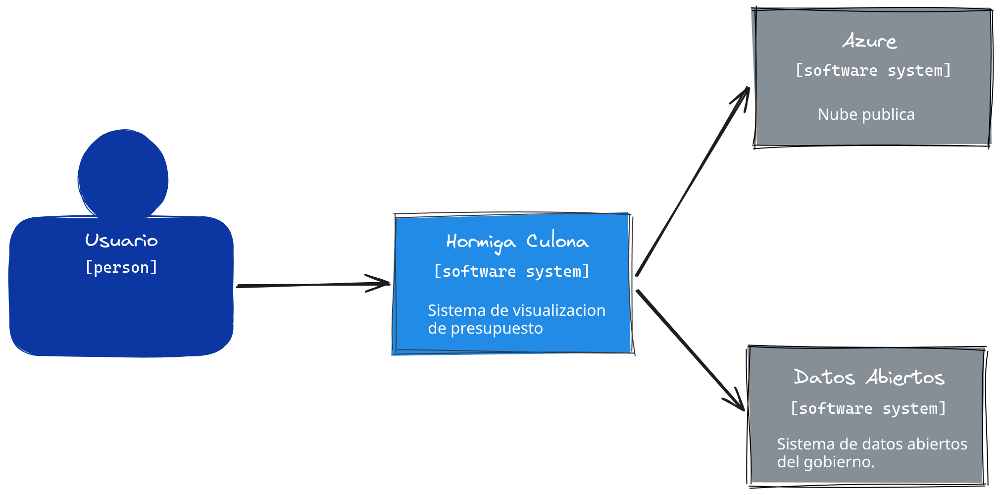
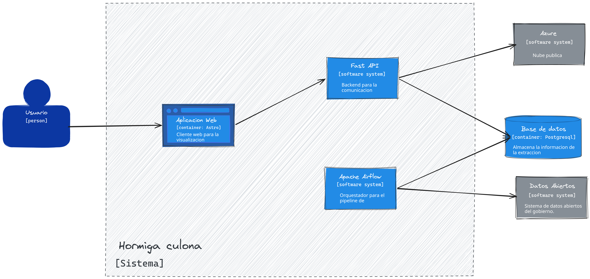
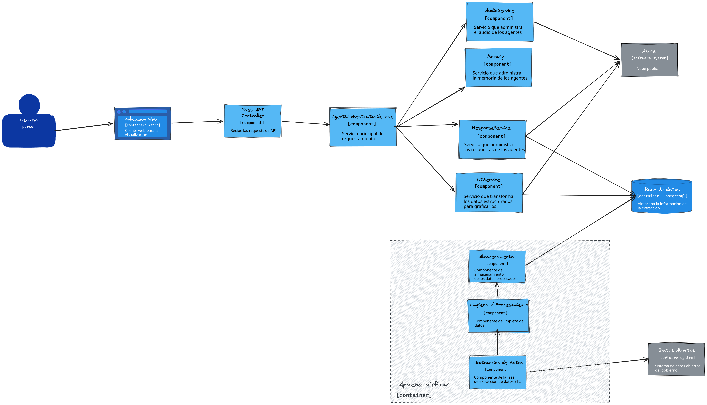

# Documentación del proyecto Hormiga Culona

## Contenido

1. Problemática
2. Propuesta de valor
3. Approach tecnológico
4. Arquitectura
5. CRISP-DM

---

# Problemática

## ¿Cuál fue nuestro reto?

Diseñar asistentes virtuales que faciliten el acceso ciudadano a datos abiertos.

## ¿Qué problema se soluciona con un asistente de datos?

La accesibilidad de los datos es una problemática actual. Aunque existan datos abiertos y haya una publicación constante de documentos financieros, de procesos y de otros temas, esto no significa que esa información sea de fácil acceso para las personas. Comprender bases de datos extensas no es suficiente con ver tablas una por una, muchas veces es necesario realizar consultas, filtrar información y relacionar distintos datos para entender qué está pasando.

Nuestra problemática nace precisamente en ese camino. Aprovechamos la transparencia actual del Estado colombiano y la reutilizamos para entregársela a cualquier tipo de persona, sin importar sus conocimientos previos. Para nosotros, el acceso a la información no significa solamente que los datos existan, sino que cualquier persona pueda entenderlos, consultarlos y usarlos.

En ese sentido, nuestra solución se relaciona directamente con esta necesidad: un asistente virtual permite que el ciudadano pregunte en lenguaje natural, por texto o por voz, y reciba respuestas más claras, consultas guiadas y resultados útiles sobre la información pública disponible. Así, el acceso deja de depender únicamente de conocimientos técnicos o del manejo de bases de datos.

## ¿Por qué es un problema que le importa al Estado?

Es una manera de promover una Colombia más abierta, en donde todos tengamos la posibilidad de ejercer control sobre los gastos, movimientos y demás actividades del Estado. El Estado no es una empresa privada, es una institución cuya principal labor es servir a las personas. Por eso, facilitar el entendimiento de la información pública también fortalece la transparencia, la confianza ciudadana y el control social.

## ¿Qué impactos positivos tiene?

Nuestra propuesta tiene un impacto directo en la percepción de conexión entre las acciones del Estado y los ciudadanos. Con esta herramienta, el acceso a la información no quedará solo en manos de expertos, por el contrario, esta solución ayuda a democratizar la información estatal, garantizando un acceso más comprensible, útil e incluyente para todos los ciudadanos.

Además, al conectar datos abiertos con asistentes virtuales capaces de responder preguntas concretas, resumir información y presentar resultados de manera más entendible, se reduce la barrera de entrada para que más personas participen, consulten y tomen decisiones informadas a partir de datos públicos.

---

# Propuesta de valor

## ¿Cuál es nuestra propuesta?

Nuestra propuesta es un aplicativo web que utiliza las bases de datos públicas de datos.gov.co y un modelo de procesamiento de lenguaje natural para que cualquier usuario pueda hacer preguntas de manera sencilla. La idea no es solamente responder preguntas, sino también presentar la información de forma útil, clara e interpretable.

El asistente no se limita a entregar una respuesta en texto. También puede organizar la información, generar visualizaciones a partir de la petición del usuario y exponer los datos de una manera que permita identificar patrones, comprender tendencias y facilitar la lectura de información pública. De esta manera, ayudamos a democratizar la información y a reducir la barrera técnica que normalmente existe entre los datos abiertos y la ciudadanía.

Además, nuestra solución incorpora interacción por voz, lo que fortalece la accesibilidad y la comunicación con el usuario. Una persona puede hablar con el sistema, hacer su consulta sin necesidad de conocimientos técnicos y recibir una respuesta clara tanto en texto como en voz. Esto amplía el alcance de la herramienta y permite que más personas puedan acceder a la información pública de una forma natural.

## ¿Qué nos diferencia?

Nos diferencia que no solo construimos un asistente que responde preguntas, sino una solución pensada para crecer, mantenerse actualizada y llegar a más personas. Nuestro stack tecnológico combina procesamiento de lenguaje natural, servicios de voz, automatización de actualización de datos, una base de datos preparada para consultas y una arquitectura que puede escalar en nube a futuro.

Usamos soluciones en nube para el manejo de la base de datos y para el despliegue de los modelos, lo que nos da posibilidades reales de crecimiento, mantenimiento y disponibilidad. Además, contamos con un pipeline de automatización que permite descargar, procesar y actualizar los datos públicos de manera continua. Esto hace que la solución no dependa de cargas manuales y que pueda sostenerse mejor en el tiempo.

Otro diferencial importante es la accesibilidad. Nuestra interfaz no se centra únicamente en texto, sino también en comunicación por voz. El usuario puede hablar, ser escuchado por el sistema y recibir una respuesta hablada. Esto hace que la herramienta sea más cercana, más intuitiva y más incluyente para personas con distintas habilidades, niveles de alfabetización digital o necesidades de acceso.

También nos diferencia que la solución conecta varias capacidades en un solo flujo. El usuario puede consultar, recibir una explicación, obtener resultados estructurados y visualizar información sin tener que conocer bases de datos, consultas técnicas o herramientas especializadas. En otras palabras, no solo damos acceso a los datos, sino acceso a su comprensión.

## ¿Por qué lo logramos?

Lo logramos porque la solución está apoyada en una arquitectura que integra varios componentes de manera coherente. Contamos con un backend que orquesta las solicitudes del usuario, una base de datos preparada para consultas, validaciones que permiten trabajar con información de forma segura, un sistema de actualización de datos y servicios de voz que hacen posible la interacción hablada.

También lo logramos porque aprovechamos datos abiertos que ya existen y los transformamos en una experiencia más entendible para la ciudadanía. En lugar de exigir que las personas aprendan a navegar datos complejos, llevamos la consulta al lenguaje natural y a una interacción mucho más humana.

## ¿Qué beneficios sociales podría traer?

Esta propuesta puede traer beneficios sociales importantes porque reduce la brecha técnica que hoy existe alrededor del entendimiento de datos públicos. Más personas podrán acceder a la información, comprenderla y usarla para hacerse preguntas sobre los procesos del Estado.

Esto puede contribuir a una población más informada, con mayor capacidad de seguimiento sobre los gastos, movimientos y decisiones públicas. También fortalece el control ciudadano, la transparencia y la participación, ya que los datos dejan de estar reservados en la práctica para perfiles técnicos y pasan a estar más cerca de cualquier persona.

La incorporación de voz y de una comunicación más natural también tiene un impacto social fuerte. Hace posible que personas con mayores barreras digitales puedan interactuar con la información pública de forma más simple, más directa y más inclusiva.

## ¿Por qué es posible escalarlo?

Es posible escalarlo porque nuestro stack tecnológico ya está pensado con crecimiento en mente. Al apoyarnos en servicios en nube para modelos, procesamiento y datos, la arquitectura puede crecer en capacidad, cobertura y usuarios sin tener que rediseñar por completo la solución.

Además, nuestra lógica actual no se limita a una sola base de datos ni a un único conjunto de documentos. El flujo que construimos permite integrar nuevas fuentes de información pública, ampliar la cobertura a más bases de datos estatales y soportar mayores volúmenes de información con tecnologías de manejo de datos más robustas cuando sea necesario.

A futuro, esto permitiría que la solución evolucione desde un caso puntual hacia una plataforma de acceso ciudadano a diferentes conjuntos de datos públicos, manteniendo la misma idea central de accesibilidad, comunicación clara y consulta en lenguaje natural.

## ¿Qué impactos podría tener a futuro?

A futuro, esta solución podría convertirse en un canal de comunicación más directo entre la ciudadanía y la información pública. Su crecimiento no solo permitiría consultar más datos, sino también mejorar la forma en que las personas entienden el funcionamiento del Estado.

Podría facilitar procesos de vigilancia ciudadana, análisis de tendencias, seguimiento presupuestal y acceso a información relevante para comunidades, periodistas, estudiantes, investigadores y ciudadanos en general. También podría impulsar nuevas formas de interacción con datos abiertos en contextos educativos, sociales e institucionales.

En el largo plazo, el mayor impacto sería aportar a una cultura de transparencia más comprensible y realmente usable, donde la información pública no solo esté disponible, sino también comunicada de una manera que las personas puedan entender, preguntar y aprovechar.

---

# Approach tecnológico

## ¿Cuál es nuestro approach?

Nuestro approach tecnológico parte de una idea simple: tomar datos públicos que ya existen y convertirlos en una experiencia de consulta mucho más natural para las personas. Para lograrlo, planteamos una solución web en la que el usuario puede interactuar por texto o por voz, hacer preguntas en lenguaje natural y recibir respuestas claras, visualizaciones y resultados útiles para interpretar la información.

La solución está pensada como una arquitectura conectada entre frontend, backend, datos y servicios de inteligencia artificial. Desde la experiencia de usuario, el frontend puede comunicarse con el sistema por medio de endpoints HTTP cuando la interacción es solo texto y por medio de WebSocket cuando se requiere una experiencia con voz. Esto permite que la comunicación sea más flexible y más cercana a una conversación real.

En el backend utilizamos FastAPI como capa principal de orquestación. Allí se reciben las solicitudes del usuario, se identifica si la intención es conversacional o si requiere una salida orientada a interfaz, se consulta la base de datos y se devuelve una respuesta estructurada. Este flujo permite no solo responder preguntas, sino también preparar información lista para tablas, gráficos, listas y otros componentes visuales.

La parte más importante de nuestro approach está en Azure, porque es el núcleo que hace posible una solución inteligente, accesible y preparada para crecer. Usamos Azure AI Foundry para el despliegue del modelo de lenguaje que interpreta las preguntas del usuario y transforma una necesidad expresada en lenguaje natural en una respuesta entendible o en una consulta útil sobre los datos. Esto nos permite construir una interacción mucho más intuitiva, sin exigir conocimientos técnicos al ciudadano.

Además, usamos Azure Speech para dos capacidades fundamentales. La primera es la transcripción de audio a texto, que permite que una persona hable con el sistema y que su consulta sea comprendida. La segunda es la síntesis de voz, que permite responder de vuelta con habla natural. Este punto es clave para la accesibilidad, porque la comunicación con el sistema deja de depender únicamente de la lectura y la escritura y se vuelve más incluyente para distintos perfiles de usuario.

Azure nos aporta beneficios concretos dentro de esta solución. Nos permite integrar modelos de lenguaje y servicios de voz dentro de una misma lógica de nube, facilita el despliegue de capacidades avanzadas sin construir esa infraestructura desde cero y nos deja una base tecnológica con posibilidades reales de crecimiento a futuro. También nos permite mantener una arquitectura más ordenada, donde la inteligencia del sistema y la capa de voz se apoyan en servicios robustos y listos para escalar.

A nivel de datos, la solución se conecta con una base preparada para consultas de solo lectura, lo que ayuda a proteger la integridad de la información. Adicionalmente, incorporamos un pipeline automatizado para extraer, procesar y cargar datos públicos a la base, garantizando que la solución no dependa solo de actualizaciones manuales y que tenga mejores condiciones para mantenerse vigente en el tiempo.

## ¿Cuál es su potencial a futuro?

El potencial a futuro de esta solución es alto porque no está pensada únicamente para resolver un caso puntual, sino para convertirse en una forma más amplia de acceso ciudadano a la información pública. Hoy trabajamos sobre conjuntos de datos específicos, pero el mismo enfoque puede extenderse a más bases de datos, más entidades y más tipos de información del Estado.

Gracias al uso de Azure, el proyecto tiene una base tecnológica con capacidad de evolución. A futuro se pueden desplegar mejores modelos, mejorar la calidad de la conversación, fortalecer la interacción por voz y ampliar la cobertura a más usuarios sin cambiar la idea principal del sistema. Esto significa que la solución puede crecer no solo en cantidad de datos, sino también en calidad de la experiencia.

También existe potencial para fortalecer el frontend como una capa más completa de visualización y comunicación. La arquitectura actual ya está pensada para entregar respuestas conversacionales, datos estructurados para interfaz y audio sintetizado, por lo que más adelante se podrían construir paneles, vistas comparativas, experiencias móviles o asistentes especializados sobre la misma base tecnológica.

## ¿Es escalable?

Sí, es escalable porque su diseño tecnológico separa responsabilidades y se apoya en servicios de nube que pueden crecer con la demanda. El backend orquesta las solicitudes, los servicios de Azure resuelven la capa de inteligencia artificial y voz, la base de datos soporta las consultas y el pipeline automatizado mantiene actualizada la información. Esta separación hace que el sistema pueda evolucionar por componentes sin tener que rehacerlo completamente.

El uso de servicios en nube es una de nuestras mayores ventajas en escalabilidad. Azure nos permite pensar en una solución que puede atender más usuarios, integrar nuevas capacidades y sostener una operación más amplia con mejores posibilidades de mantenimiento. Esto nos diferencia porque no estamos construyendo una demo aislada, sino una base tecnológica que puede crecer hacia un producto público real.

Además, la solución ya contempla distintos canales de comunicación con el usuario. Puede funcionar en texto, en voz y en respuestas orientadas a interfaz. Esa flexibilidad ayuda a escalar no solo en infraestructura, sino también en usos posibles, ya que la misma lógica puede alimentar chat, asistentes hablados, paneles visuales y futuras integraciones.

## ¿Por qué es novedoso?

Es novedoso porque no se limita a mostrar datos abiertos ni a responder preguntas de forma aislada. Nuestra propuesta conecta lenguaje natural, consulta de datos, visualización y comunicación por voz dentro de una misma experiencia. Esto hace que el acceso a la información pública sea más natural, más comprensible y más cercano para las personas.

También es novedoso porque prioriza la accesibilidad como parte central de la solución y no como un añadido posterior. La posibilidad de hablar con el sistema y recibir respuestas por voz amplía el alcance del proyecto y mejora la relación entre ciudadanía e información pública. En lugar de pedirle al usuario que aprenda a navegar bases de datos complejas, llevamos la información a un formato de conversación.

Otro punto novedoso es que nuestro stack tecnológico no solo resuelve el presente, sino que está pensado para crecer. La combinación de Azure AI Foundry, Azure Speech, backend modular, base de datos en nube y automatización de actualización de datos crea una solución con valor inmediato y con proyección futura. Esa capacidad de crecimiento es parte de lo que nos diferencia.

## Accesibilidad para muchos no significa para todos

Para nosotros, accesibilidad para muchos no significa necesariamente accesibilidad para todos. Una solución realmente útil no puede asumir que todas las personas se relacionan igual con la tecnología, con la lectura, con la escritura o con la interpretación de tablas complejas. Por eso, nuestro approach tecnológico da tanta importancia a la voz y a la comunicación clara.

La integración de transcripción y síntesis de voz con Azure permite abrir una puerta distinta de acceso a la información pública. Una persona puede hablar, preguntar de forma natural y recibir una respuesta hablada y entendible. Esto hace que la solución sea más incluyente y que la experiencia no dependa únicamente de interfaces tradicionales.

En ese sentido, la tecnología no está solo al servicio de procesar datos, sino también de comunicar mejor. Ese es uno de los puntos más fuertes de nuestra solución: no solo acercamos información pública a las personas, sino que la acercamos en un formato más humano, más usable y con mejores condiciones de accesibilidad.

---

# Arquitectura

En esta seccion se va a describir de manera general la arquitectura de la solucion propuesta. La documentacion arquitectonica sigue el estandar **C4** para describir el sistema en distintos niveles de abstraccion.

## Diagrama de contexto

En primera instancia el diagrama de contexto (nivel 1 del modelo C4) provee una vista general de la solucion y las interacciones existentes con sistemas externos.

El diagrama muestra a **Hormiga Culona**, el sistema de visualizacion de presupuesto, como nucleo de la solucion. El **Usuario** interactua directamente con la aplicacion para consultar informacion publica en lenguaje natural (texto o voz) y recibir respuestas claras con visualizaciones.

Hacia afuera, Hormiga Culona depende de dos sistemas externos:

- **Azure** (nube publica): se usa principalmente para el alojamiento del agente y los servicios de IA que interpretan las consultas del usuario.
- **Datos Abiertos** (sistema de datos abiertos del gobierno): se usa principalmente para extraer los datos publicos que alimentan la visualizacion y las respuestas del sistema.

## Diagrama de contenedores

El diagrama de contenedores (nivel 2 del modelo C4) descompone Hormiga Culona en los bloques ejecutables que conforman la solucion y muestra como se comunican entre si y con los sistemas externos.

Dentro del sistema se identifican los siguientes contenedores:

- **Aplicacion Web (Astro):** cliente web de visualizacion con el que interactua el usuario. Envia las consultas (texto o voz) hacia el backend y presenta respuestas, tablas y graficos.
- **FastAPI:** backend de comunicacion y orquestacion. Recibe las peticiones del frontend, consulta la base de datos, se conecta con Azure para el agente/IA y devuelve respuestas estructuradas listas para la interfaz.
- **Apache Airflow:** orquestador del pipeline de datos. Extrae informacion de Datos Abiertos, la procesa y la carga en la base de datos.
- **Base de datos (PostgreSQL en Supabase):** almacena la informacion resultante de la extraccion. Airflow escribe los datos cargados y FastAPI los consulta en modo lectura para responder al usuario.

Como sistemas externos al diagrama:

- **Azure:** nube publica donde se alojan el agente y los servicios de IA/voz que FastAPI consume.
- **Datos Abiertos:** fuente gubernamental de la que Airflow extrae los datos que alimentan el sistema.

## Diagrama de componentes

El diagrama de componentes (nivel 3 del modelo C4) detalla la estructura interna de los contenedores: como se descompone el backend, como el agente orquesta servicios especializados y como el pipeline de Airflow alimenta la base de datos.

### Flujo de consulta del usuario

El **Usuario** interactua con la **Aplicacion Web (Astro)**, el cliente de visualizacion. Esta envia peticiones HTTP al backend, donde el **Fast API Controller** actúa como punto de entrada: recibe los requests de la API y los deriva al nucleo de la logica de negocio.

El **AgentOrchestratorService** es el servicio principal de orquestacion. Centraliza la peticion del usuario, decide que capacidades del agente se requieren (voz, memoria, respuesta conversacional o salida para interfaz) y coordina el resto de componentes.

### Componentes del agente

Bajo el control del orquestador operan cuatro componentes especializados:

- **AudioService:** administra el audio de los agentes (transcripcion y sintesis de voz). Se apoya en Azure (p. ej. Azure Speech) para convertir voz a texto y respuestas a audio, habilitando la interaccion hablada.
- **Memory:** gestiona la memoria contextual de los agentes, de modo que la conversacion conserve historial y coherencia entre turnos. Tambien se apoya en Azure.
- **ResponseService:** administra la generacion de respuestas del agente a partir del lenguaje natural. Consulta Azure para el modelo de lenguaje y la **base de datos** cuando la respuesta requiere datos presupuestales o publicos ya cargados.
- **UIService:** transforma datos estructurados en formatos listos para graficar o renderizar en la interfaz (tablas, charts, listas). Consulta la **base de datos** para obtener la informacion a visualizar y se apoya en Azure cuando hace falta procesamiento adicional.

Asi, la consulta del usuario puede resolverse como conversacion (texto/voz) o como salida orientada a interface, sin cambiar el punto de entrada.

### Persistencia y sistemas externos

- **Azure (nube publica):** hospeda y provee los servicios de IA y voz que consumen AudioService, Memory, ResponseService y UIService.
- **Base de datos (PostgreSQL en Supabase):** almacena la informacion proveniente de la extraccion. La consultan **ResponseService** y **UIService** para armar respuestas y visualizaciones; tambien recibe la carga final del pipeline de Airflow.

### Pipeline de datos (Apache Airflow)

De forma asincrona al flujo de consulta, el contenedor **Apache Airflow** ejecuta un pipeline ETL compuesto por tres componentes encadenados:

1. **Extraccion de datos:** obtiene los datasets publicos desde **Datos Abiertos** (sistema de datos abiertos del gobierno).
2. **Limpieza / Procesamiento:** recibe los datos crudos, los limpia y los transforma a un esquema util para consulta.
3. **Almacenamiento:** persiste el resultado limpio en la **base de datos** de Supabase.

Con esto, el sistema separa claramente dos vias: el camino interactivo (usuario → web → controller → orquestador → servicios del agente → Azure/BD) y el camino de alimentacion de datos (Datos Abiertos → extraccion → limpieza → almacenamiento → BD).

### Estilo de comunicacion

La comunicacion entre componentes es principalmente **REST** para la mayoria de los servicios (consultas de texto, respuestas estructuradas, visualizacion y operaciones habituales del backend). Para la **comunicacion de voz** entre el front-end y el backend se utilizan **WebSockets**, lo que permite un canal bidireccional en tiempo real adecuado para streaming de audio (transcripcion y sintesis).

### Arquitectura del back-end

La arquitectura del back-end es principalmente en **capas**: el controller recibe la peticion, el orquestador coordina la logica de aplicacion y los servicios especializados (audio, memoria, respuesta, UI) encapsulan responsabilidades concretas hacia Azure y la base de datos. Esta separacion mantiene el flujo ordenado y facilita evolucionar cada capa de forma independiente.

---

# CRISP-DM — Hormiga Culona
## IA sobre datos de presupuesto público — Datos Abiertos Colombia (Bucaramanga)

---

## Fase I — Business Understanding

### 1.1 Objetivo de negocio

[Datos Abiertos Colombia](https://www.datos.gov.co/) es la plataforma del
gobierno donde se publican datos públicos (presupuesto municipal, casos de
infección, datos satelitales, etc.). En particular, los datos de **egresos e
ingresos del Presupuesto General del Municipio de Bucaramanga** se publican
como archivos Excel/CSV extensos, con un formato pensado para exportación
contable y no para consulta ciudadana: códigos sin documentación, valores
centinela numéricos (`-88`, `-98`) en vez de vacíos, bloques semestrales
pegados uno tras otro sin separación clara.

**Problema:** esta forma de publicar los datos los hace, en la práctica,
inaccesibles para cualquier persona sin conocimientos técnicos o de
presupuesto público.

**Objetivo del proyecto:** construir una solución basada en IA que permita a
cualquier ciudadano hacer preguntas en lenguaje natural sobre los gastos e
ingresos del municipio y obtener respuestas correctas, sin tener que abrir ni
interpretar los archivos originales.

### 1.2 Criterios de éxito

- Un usuario sin conocimientos técnicos puede hacer una pregunta (ej. "¿cuánto
  se ejecutó del presupuesto de 2023?") y obtener una respuesta correcta.
- Las respuestas deben ser trazables al dato fuente (año, periodo semestral,
  archivo de origen) para poder auditarlas.
- El sistema no debe inventar cifras cuando el dato no existe o es ambiguo.

### 1.3 Alcance inicial

- Datasets: `RESUMEN_EGRESOS_PRESUPUESTO_GENERAL_DEL_MUNICIPIO_DE_BUCARAMANGA`
  y `RESUMEN_INGRESOS_PRESUPUESTO_GENERAL_DE_BUCARAMANGA`.
- Periodo cubierto: semestres desde 2017-2 hasta 2025-1.
- Fuera de alcance por ahora: otros datasets de Datos Abiertos (infecciones,
  datos satelitales, etc.) — se evaluará como fase futura del proyecto.

---

## Fase II — Data Understanding

### 2.1 Recolección inicial de datos

Se descargaron los dos archivos CSV directamente de Datos Abiertos Colombia:
- `RESUMEN_EGRESOS_PRESUPUESTO_GENERAL_DEL_MUNICIPIO_DE_BUCARAMANGA_20260708.csv`
- `RESUMEN_INGRESOS_PRESUPUESTO_GENERAL_DE_BUCARAMANGA_20260708.csv`

### 2.2 Descripción de los datos

| | Egresos | Ingresos |
|---|---|---|
| Filas totales (crudas) | 39,752 | 3,968 |
| Columnas por fila | 15 | 12 |
| Encoding | utf-8 | utf-8 |
| Semestres detectados | 17 (2017-2 → 2025-1) | 16 (2017-2 → 2025-1) |

Ambos archivos vienen con **todos los semestres pegados uno tras otro** en
un solo CSV, separados por una fila-marcador de texto libre (ej. "GASTOS A
31 DICIEMBRE 2017"), en vez de venir un archivo por periodo. Las columnas no
tienen encabezado documentado oficialmente — el significado de cada columna
se infirió por inspección manual.

### 2.3 Exploración de datos (EDA)

Se construyó `eda_previo.py`, que recorre los datos crudos, antes de
cualquier limpieza, y genera evidencia visual y estadística:

- **Prevalencia de valores centinela** (candidatos a "nulo"): entre 24.2% y
  96.6% según la columna, en ambos datasets. Los valores encontrados fueron
  consistentemente `-88`, `-98` y variantes, además de guiones sueltos (`-`).
- **Distribución y outliers:** las columnas monetarias muestran outliers
  extremos pero en general plausibles para un presupuesto municipal.
- **Distribución de anchos de fila:** 100% de las filas en ambos archivos
  coincide con el ancho esperado (15 columnas en egresos, 12 en ingresos).

---

## Fase III — Data Preparation

Implementada en `data_processing.py`.

### 3.1 Selección de datos

Se descartan:
- **Código/rubro crudo** (columna 0 en ambos archivos): sin documentación
  oficial disponible sobre su nomenclatura.
- **Columna 12 de egresos**: siempre vacía o `-88` en todos los periodos
  revisados.

### 3.2 Limpieza de datos

- **Valores centinela → nulo:** el conjunto `SENTINELAS_VACIO` (`-88`, `-98`
  y variantes, `-`, `--`, vacío, `NA`, `NULL`) se convierte a `""`.
- **Separador decimal/miles:** lógica que detecta si la coma o el punto es
  el separador decimal según su posición y cantidad de dígitos.
- **Encoding:** detectado automáticamente por archivo con `chardet`.
- **Filas de leyenda/relleno:** al inicio de cada bloque semestral, se
  descartan filas con descripción vacía o "NO APLICA" hasta encontrar la
  primera fila con datos reales.
- **Anchos de fila irregulares:** se rellenan o truncan filas que no
  coincidan con el ancho esperado (código defensivo).

### 3.3 Construcción de datos

Cada fila de salida se enriquece con `id` (trazable, ej.
`egr-2018-1-00042`), `anio`, `periodo` y `archivo_origen`.

### 3.4 Integración de datos

Egresos e ingresos se procesan y consolidan por separado, generando
`egresos_consolidado.csv` e `ingresos_consolidado.csv`.

### 3.5 Formato de datos

Salida estandarizada en CSV, encoding `utf-8`, valores numéricos como texto
decimal estándar (punto como separador decimal).

### 3.6 Trazabilidad de la corrida

Cada ejecución genera `validacion_consolidacion.txt` con el detalle de
semestres detectados, filas de datos, filas descartadas y filas
problemáticas por archivo.

---

## Fase IV — Modeling

### 4.1 Selección de la técnica de modelado

**No se usó RAG.** Se descartó porque los datos ya son estructurados (tablas
en Postgres) — un vector store con embeddings no aporta nada cuando el dato
ya vive en filas y columnas con esquema conocido.

**Enfoque real: arquitectura de agentes** (`AgentOrchestratorService`), con
tres piezas especializadas:

| Agente | Responsabilidad |
|---|---|
| `queryAgent` | responde preguntas en lenguaje natural, con la tool `sql_query`, manteniendo contexto conversacional |
| `UIAgent` | traduce la solicitud a un `UIPlan` (JSON con `title`, `component`, `sql`, `summary`) para tablas/gráficos en el frontend |
| `ResultAgent` | toma resultados ya consultados y los resume en `explanation` (texto/UI) y `voice_reply` (audio) |

El orquestador decide el flujo según el canal: modo `response` (chat corto),
modo `ui` (reporte/gráfico estructurado), o modo `audio` (transcripción →
uno de los dos anteriores → síntesis de voz).

**Modelo:** GPT-5-mini, servido vía Azure AI Foundry — económico y rápido,
suficiente para las tareas actuales de generar SQL de solo lectura y narrar
resultados.

**Herramienta del agente:** `sql_query`, que hace `POST` a `/agent/sql`,
permitiendo que el agente ejecute consultas de solo lectura a través del
propio backend.

**Contexto de esquema:** `SchemaCacheService` mantiene en RAM el esquema de
las tablas junto con descripciones humanas, refrescándose cada hora vía
`APScheduler`.

### 4.2 Construcción del modelo

No hay entrenamiento ni fine-tuning propio: se usa GPT-5-mini pre-entrenado,
orquestado mediante el sistema de agentes descrito arriba.

### 4.3 Evaluación técnica del modelo

Cubierta por la suite de tests existente (`tests/agents/`, `tests/audio/`,
`tests/full_system_test/`). Adicionalmente, `AgentDatabaseService` valida en
tiempo de ejecución que cualquier SQL generado sea de solo lectura (solo
permite `SELECT`/`WITH`, bloquea `INSERT`/`UPDATE`/`DELETE`/`DROP`/`ALTER`/
`TRUNCATE`/`CREATE`).

---

## Fase V — Evaluation

### 5.1 Evaluar resultados

Existen dos capas de evaluación:
1. **Evaluación técnica/funcional** (automatizada): los tests confirman que
   el sistema corre de punta a punta sin errores.
2. **Evaluación de exactitud de contenido** (manual): revisión de que la
   lógica del SQL generado tenga sentido y que la respuesta corresponda con
   lo que arroja la base.

### 5.2 Revisar el proceso

El sistema ya cuenta con salvaguardas técnicas relevantes: solo lectura
forzada en SQL, cache de esquema actualizado, y separación clara entre modo
conversacional y modo UI.

---

## Fase VI — Deployment

### 6.1 Plan de despliegue

**Estado: ya corriendo (demo/producción).** Backend en FastAPI, empaquetado
en Docker (`python:3.14-slim`, expone puerto `8000`, arranca con `uvicorn
main:app`). Expone tres canales: chat texto (`/agent/chat`), generación de
datos para UI (`/agent/ui`), y voz por HTTP y WebSocket
(`/agent/audio/transcription`, `/agent/audio/synthesis`,
`/ws/agent/voice/{session_id}`).

### 6.2 Monitoreo y mantenimiento

- **Refresco de datos:** pipeline ETL con Airflow (`budget_pipeline`,
  tareas `extract` → `process` → `load`) que descarga, procesa y carga los
  datasets desde `datos.gov.co` a Supabase/Postgres.
- **Refresco de esquema:** `SchemaCacheService` se refresca cada hora
  automáticamente.

### 6.3 Reporte final

Este documento constituye el reporte final del proyecto Hormiga Culona para
este ciclo de CRISP-DM.

---

---
